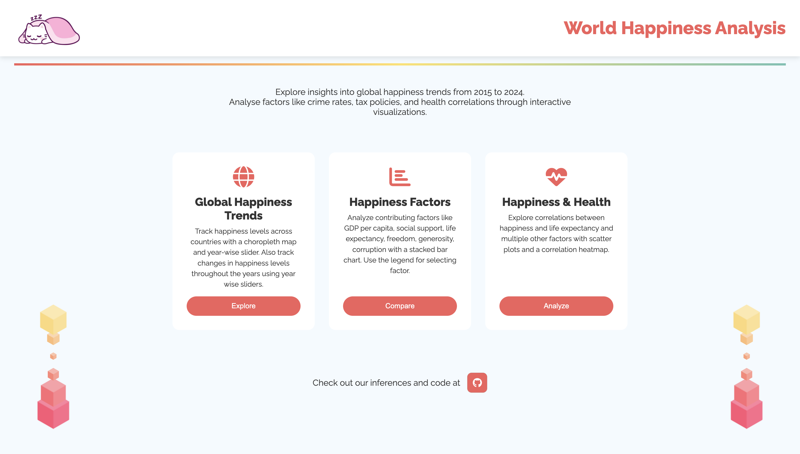

# World Happiness Score Analysis

[Visit the live project here](https://world-happiness-score.vercel.app/)

## Overview
An interactive visualization project analyzing global happiness trends from 2015 to 2024. The project explores various factors contributing to happiness scores across different countries, including GDP, social support, health metrics, and more.

## Visualizations

### 1. Global Happiness Trends Map
- **File:** `choropleth.html`
- **Description:** Interactive choropleth map showcasing happiness scores worldwide
- **Features:**
  - Year-wise slider (2015-2024)
  - Toggle between absolute scores and changes over time
  - Country search functionality
  - Color-coded visualization with confidence intervals
  - Interactive tooltips showing detailed country data

### 2. Happiness Factors Analysis
- **File:** `bar.html`
- **Description:** Stacked bar chart analyzing different factors contributing to happiness
- **Features:**
  - Interactive legend for factor selection
  - Regional filtering options
  - Country search functionality
  - Detailed tooltips
  - Factor descriptions
  - 95% confidence interval indicators
  - Animated transitions

### 3. Happiness Correlations
- **File:** `vis.html`
- **Description:** Advanced correlation analysis between happiness and various factors
- **Features:**
  - Interactive correlation heatmap
  - Scatter plots with trend lines
  - Factor selection dropdown
  - Real-time correlation coefficients
  - Responsive design

## Running the Project
### Prerequisites
- Modern web browser (Chrome, Firefox, Safari)
- Local server capability (Python or Node.js)

### Setup
1. Clone the repository:
   ```sh
   git clone https://github.com/ArihantRastogi/World_Happiness_Score.git
   cd World_Happiness_Score
   ```

2. Start a local server:
   ```sh
   # Using Python 3
   python -m http.server 8000
   
   # OR using Python 2
   python -m SimpleHTTPServer 8000
   ```

3. Access the project:
   - Open your browser and navigate to `http://localhost:8000`

## Technologies Used
- D3.js for data visualization
- HTML5/CSS3 for structure and styling
- Modern JavaScript (ES6+)
- Responsive design principles
- Plotly.js for scatter plot and correlation heatmap

## Data Sources
- World Happiness Report datasets (2015-2024)
- Additional metrics including:
  - GDP nominal values
  - Tax rates
  - Health indicators
  - Social metrics

## Contributors
- Project developed by
    - Arihant Rastogi [GitHub](https://github.com/ArihantRastogi)
    - Manasi Mundada [GitHub](https://github.com/manasimundada)
    - Hrishiraj Mitra [GitHub](https://github.com/hrishirajmitra)
- Part of Data Visualization course project
